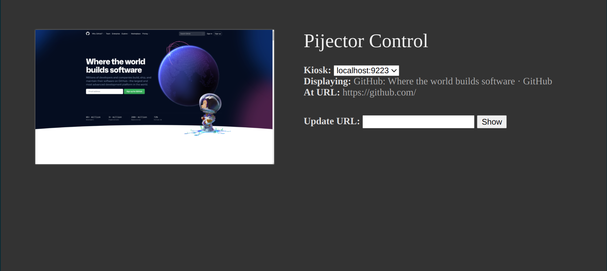

# Pijector

Pijector is yet another piece of Kiosk software designed for Raspberry Pi. It
uses the Chrome Devtools Protocol (via the [rod](https://github.com/go-rod/rod)
library) to control a Chromium instance as a Kiosk display.

## Usage

You will need to launch a Chromium instance in debug mode as a prerequisite. For
example:

```console
$ chromium-browser \
    --incognito \
    --kiosk \
    --no-first-run \
    --remote-debugging-port=9222 \
    --user-data-dir=$(mktemp -d) \
    -- \
        "about:blank"

DevTools listening on ws://127.0.0.1:9222/devtools/browser/b2d22b3a-dd60-4aa8-86fc-fa494d90e1dc
```

Then, point the Pijector server at the remote debugger port.

```console
$ pijector server --help
NAME:
   pijector-linux-amd64 server - Run the pijector server

USAGE:
   pijector-linux-amd64 server [command options] [arguments...]

OPTIONS:
   --kiosk value, -k value        ip:port on which Chromium Kiosk's debugger is listening (default: "127.0.0.1:9222") [$BILLBOARD_KIOSK_ADDRESS]
   --listen value, -L value       ip:port on which to serve API requests (default: "0.0.0.0:9292")
   --default-url value, -d value  Default URL to open in the Chromium Kiosk (default: "http://localhost:9292/") [$BILLBOARD_KIOSK_DEFAULT_URL]
   --help, -h                     show help (default: false)
$ pijector server -k localhost:9222

```

As soon as the Pijector server starts, it will take control of the Chromium
instance. It will navigate to the pijector default page, and come to the
foreground.

## Control

Pijector serves a control interface at
[localhost:9292/admin](http://localhost:9292/admin) by default. It has a very
simple interface which allows the user to select a kiosk display and modify the
URL it is displaying.



### API

There is an incredibly simple API, which the admin interface uses to discover
and control kiosks.

- `GET /api/v1/kiosk` will return an object describing the kiosks controlled by
  the Pijector instance.

- `GET /api/v1/kiosk/$KIOSKID` will return details about the kiosk's current
  display.

- `GET /api/v1/kiosk/$KIOSKID/stat` is an alias for `/api/v1/kiosk/$KIOSKID`

- `GET /api/v1/kiosk/$KIOSKID/show?target=$TARGETURL` will instruct the kiosk to
  display the provided `$TARGETURL`.

- `GET /api/v1/kiosk/$KIOSKID/snap` will return a full-resolution PNG screenshot
  of the kiosk's current display.